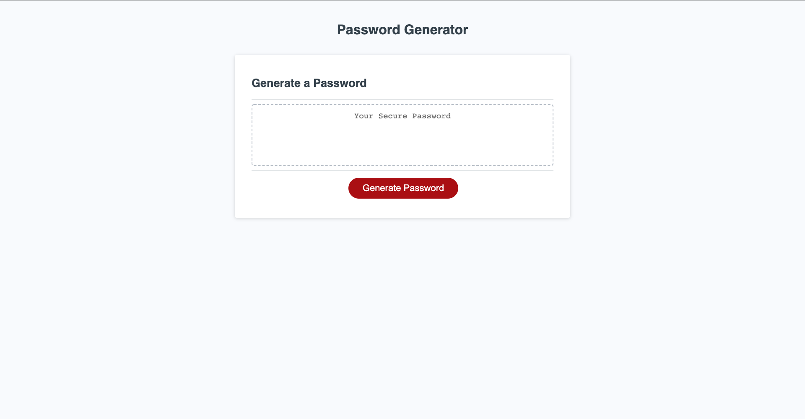

# Password-gen_script

## Description

This is a safe password generator made with JavaScript. There are multiple options where you can select from to generate a secure password that suits you. From 8 up to 128 characters, you can make a completely safe and indecipherable password.


## Usage

Click on the **generate password** button and then fill up the prompts to specify what the kind of password want and thats it!



## Installation

You can clone the project from the this [repository!](https://github.com/JanInquisitor/password-gen_script)


```
git clone https://github.com/JanInquisitor/password-gen_script

```

## Contributing

Anyone is welcome to contribute to this project and implement better refactoring practices

## License

See the [LICENSE](https://www.google.com/) file for information.